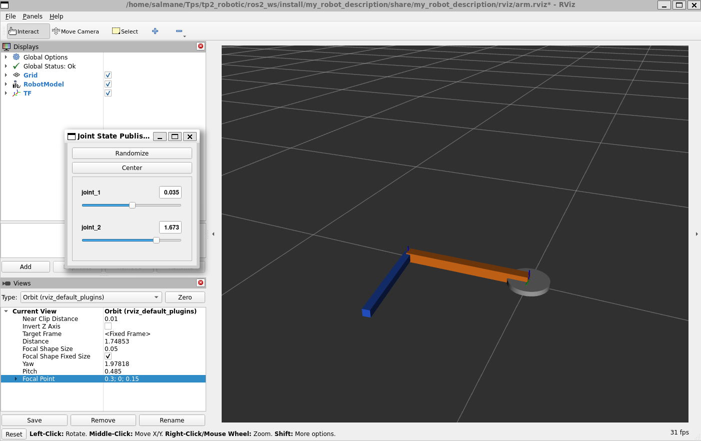
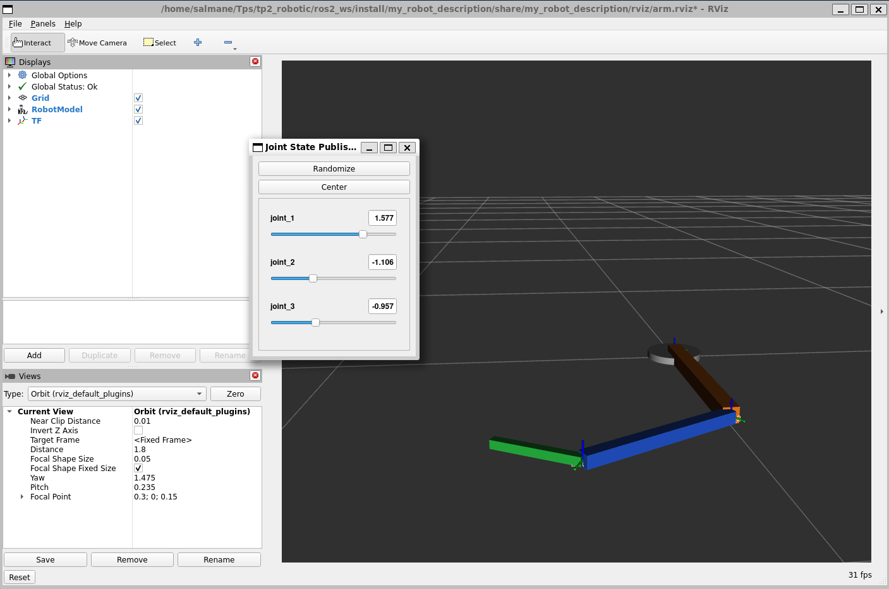
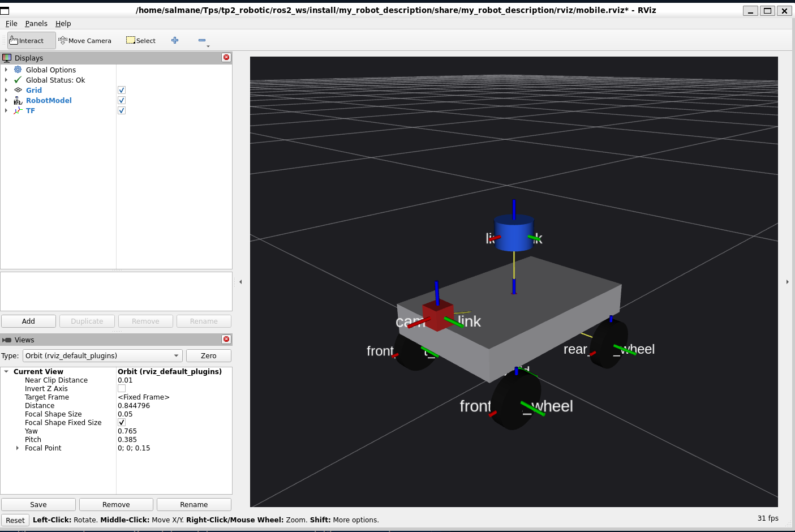
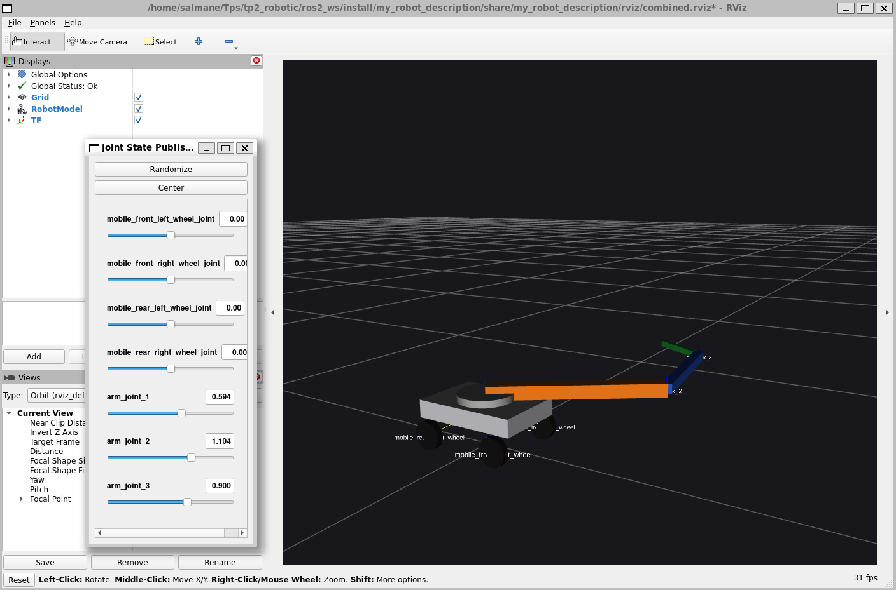

# TP2 ROS 2 Robot Description Project

This repository contains a clean ROS 2 description workspace for a robotics TP built for Ubuntu under WSL. It covers the full progression from a basic URDF model to articulated arms, Xacro refactoring, mobile robots, onboard sensors, and a combined mobile manipulator.

## Highlights

- ROS 2 Humble description package using `ament_cmake`
- Plain URDF and modular Xacro implementations
- RViz2 launch flows for arm, mobile, sensor, and combined robots
- Helper scripts for setup, build, validation, and launch
- Validated in a live Ubuntu WSL environment with RViz2 and `joint_state_publisher_gui`

## Project Scope

The repository implements:

1. A basic single-link URDF robot
2. A plain URDF 2R articulated arm
3. RViz2 visualization with `robot_state_publisher` and `joint_state_publisher_gui`
4. A modular Xacro refactor
5. Exercise 1: 3R planar arm
6. Exercise 2: 4-wheel mobile robot
7. Exercise 3: mobile robot with sensors
8. Bonus: combined mobile robot with a 3R arm

## Screenshots

### 2R Arm



### 3R Arm



### Mobile Robot With Sensors



### Combined Mobile Manipulator



## Repository Layout

```text
.
├── docs/
├── tools/
├── .vscode/
└── ros2_ws/
    └── src/
        └── my_robot_description/
            ├── launch/
            ├── meshes/
            ├── rviz/
            ├── test/
            └── urdf/
```

The ROS 2 package is [`my_robot_description`](ros2_ws/src/my_robot_description).

## Prerequisites

Required on Ubuntu/WSL:

- ROS 2 Humble or another compatible ROS 2 distro installed under `/opt/ros`
- `colcon`
- `xacro`
- `robot_state_publisher`
- `joint_state_publisher_gui`
- `rviz2`
- `check_urdf`

This repository does not require a Python virtual environment for ROS 2 itself. ROS tools should run from the system installation that matches the distro. A `.venv` is intentionally not created because it would not help the core TP workflow.

## WSL Notes

This repo is designed for Linux paths and bash scripts inside WSL. Keep it in the Linux filesystem, such as `/home/...`, not under `/mnt/c/...`.

For GUI tools like RViz2:

- WSLg is the easiest path on recent Windows 11 setups
- On older setups, use an X server and ensure graphical forwarding works

## Open In VS Code Remote - WSL

1. Open a WSL terminal.
2. Change into the repo:

   ```bash
   cd <your-repo-path>
   ```

3. Open VS Code in the current WSL folder:

   ```bash
   code .
   ```

## Publish To GitHub

Once you create an empty GitHub repository, you can publish this local repo with:

```bash
git remote add origin git@github.com:<your-user>/<your-repo>.git
git branch -M main
git push -u origin main
```

If you prefer HTTPS:

```bash
git remote add origin https://github.com/<your-user>/<your-repo>.git
git branch -M main
git push -u origin main
```

## Install Missing ROS Packages

If your machine is missing ROS runtime tools, follow [INSTALL_WSL_UBUNTU.md](INSTALL_WSL_UBUNTU.md).

## Build

From the repo root:

```bash
source tools/source_ros.sh
tools/build_workspace.sh
```

Or manually:

```bash
source /opt/ros/humble/setup.bash
cd ros2_ws
colcon build --packages-select my_robot_description --cmake-args -DPython3_EXECUTABLE=/usr/bin/python3
source install/setup.bash
```

This extra CMake argument is intentional on machines where `python3` on `PATH` points to `pyenv` instead of Ubuntu's system Python. ROS 2 package metadata tools expect the distro Python environment.

## Source The Environment

Use:

```bash
source tools/source_ros.sh
```

That script attempts to source:

- `/opt/ros/<distro>/setup.bash`
- `ros2_ws/install/setup.bash` if the workspace has already been built

## Launch Each Robot

After building:

```bash
source tools/source_ros.sh
tools/launch_2r.sh
tools/launch_3r.sh
tools/launch_mobile.sh
tools/launch_mobile_sensors.sh
tools/launch_combined.sh
```

You can also launch manually:

```bash
source tools/source_ros.sh
ros2 launch my_robot_description display.launch.py
ros2 launch my_robot_description display_2r.launch.py
ros2 launch my_robot_description display_3r.launch.py
ros2 launch my_robot_description display_mobile.launch.py
ros2 launch my_robot_description display_mobile_sensors.launch.py
ros2 launch my_robot_description display_combined.launch.py
```

## Validate URDF And Xacro

Check the environment:

```bash
tools/env_check.sh
```

Generate URDF previews:

```bash
tools/generate_urdf_preview.sh 2r
tools/generate_urdf_preview.sh 3r
tools/generate_urdf_preview.sh mobile
tools/generate_urdf_preview.sh mobile_sensors
tools/generate_urdf_preview.sh combined
```

Run the validation helper:

```bash
bash ros2_ws/src/my_robot_description/test/test_xacro_commands.sh
./tools/validate_workspace.sh
```

If `xacro` is unavailable, the preview and Xacro validation steps will fail honestly and point you back to the install guide.

## Expected RViz Behavior

- `display.launch.py`: one simple cylinder in the `world` frame
- `display_2r.launch.py`: a 2-link planar arm on a cylindrical base with two controllable revolute joints
- `display_3r.launch.py`: a 3-link planar arm with three controllable revolute joints
- `display_mobile.launch.py`: a box chassis with four rotated wheels
- `display_mobile_sensors.launch.py`: the mobile base plus LiDAR and camera frames
- `display_combined.launch.py`: the mobile base with a mounted 3R arm

## Troubleshooting

See:

- [docs/troubleshooting.md](docs/troubleshooting.md)
- [docs/validation_checklist.md](docs/validation_checklist.md)
- [docs/runtime_validation_2026-03-22.md](docs/runtime_validation_2026-03-22.md)
- [INSTALL_WSL_UBUNTU.md](INSTALL_WSL_UBUNTU.md)
